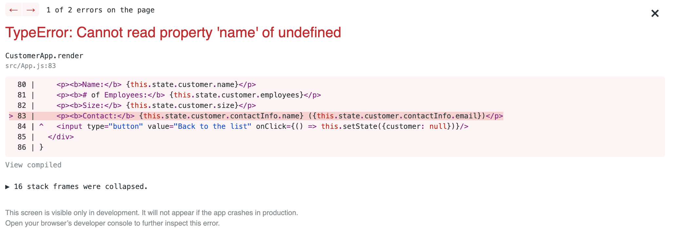
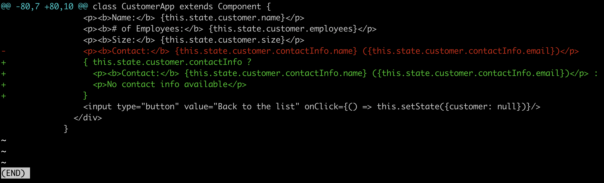

# Customers App Test Plan

Based on the [app requirements](https://github.com/chema-delbarco/Hopin-Exam-QE/blob/main/Requirements.md#customers-app), below is a list of test cases to ensure that all functionalities work from the user's perspective.

> The Customers App web application is aimed to our sales people so that they can have access to our customer's contact information.
>
> Note: This test plan doesn't cover API tests with tools such as Postman. The idea is to test the app end-to-end, ensuring that both the frontend and API works as expected when connected with each other.
>
> In this docs, every test case is a TC (e.g.: TC1, TC2, TCn).

## Pre-condition

With the app servers up-and-running locally (backend and frontend), visit http://localhost:3000.

> Note: If you're testing on a remote enviroment, visit its address instead.

## Welcome Screen

> The Welcome Screen presents the user to a form where he/she can be identified.

### TC1 - Initial State

**Expected result:** When in the home page, you should see a heading (Welcome to Customer App), a paragraph (Please provide your name:), an input text field, and a submit button.

**Actual result:** Passed. ✅

### TC2 - Submits the form without filling the text field

**Steps:**  Hit submit without filling the text field.

**Expected result:** You should see an alert with the text "Please provide your name". After confirming the alert you should be able to get back to the form to fill in the text field.

**Actual result:** Passed. ✅

### TC3 - Submits the form after filling the text field

**Steps:** Fill in the text field with your name and hit submit.

**Expected result:** You should see the **Customer List Screen** (which we will test in the next section of this test plan.)

**Actual result:** Passed. ✅

## Customer List Screen

> This screen presents the list of all registered customers.

**Pre-condition:** Fill in the text field with your name and hit submit.

### TC4 - Greeting

> I've created this test case based on how the app behaves since this is not described in the app requirements.

**Expected result:** You should see a greeting based on the name typed in the text field with the following format:

Hi **[your-name-here]**. It is now **Tue Aug 24 2021** and here is our customer list. Click on each of them to view their contact details.

> Note: the above date is just an example. It should show the current date.

**Actual result:** Passed. ✅

### TC5 - List of customers

**Expected result:** You should see a list of all registered customers. For each customer, the following info should be shown:

- Name: [customer-name]
- \# of Employees: [n]
- Size: Needs clarification (see notes below)

**Actual result:** ❓

> Note: There seems to be an issue with the app requirements between the client (Graphical User Interface App) and the server (API).
>
> At the **Customer List Screen** section, it says "Size: if # of Employees is less than or equal 100, size is Small; if greater then 10 and less then or equal 1000, Medium; otherwise, Big"
>
> Shouldn't the Medium size be between 101 and 1000?
>
> Also, at the bottom of the app requirements (at the API section), it says "customer size is: Small, when # of employees is <= 10; Medium when it is <= 1000; Big otherwise."
>
> This statement differs from the previous that said that Small was until 100 employees, not 10.
>
> We need to clarify with the business what's the rule, and fix it accordingly. Finally, when fixing it, I suggest covering all scenarios with tests so that no bug can come back, and no more confusion will happen.
>
> As a reference, [here](https://github.com/chema-delbarco/Hopin-Exam-QE/blob/main/backend/server.js#L26)'s how it's implemented at the API.
>
> There's also a grammar issue, where in some places it mentions greater **then** and less **then**, when it should be greater **than** and less **than**.
### TC6 - Clicks customer name

**Steps:** Click in a sample (or all if they're just a few) of customer name links.

**Expected result:** You should see the **Contacts Detail Screen** (which we will test in the next section of this test plan.)

**Actual result:** Failed ❌

When clicking in the name of a customer without contact info (e.g.: United Brands), the app crashes with the following error:

**Resolution**: Here's how I'd solve it:

## Contacts Detail Screen

> This screen shows customers details.

**Pre-condition:** Fill in the text field with your name and hit submit.

### TC7 - Greeting

> I've created this test case based on how the app behaves since this is not described in the app requirements.

**Steps:** Click in a random customer name link.

**Expected result:** The greeting from the previous screen should still be visible.

**Actual result:** If contact info exists, it passes ✅, other way, it fails  ❌ with the same crash found on TC6.

### TC8 - Customer with contact info and size Big

**Steps:** Click the 'Bananas Corp' link.

**Expected result:** You should see the following Customer Details:

**Customer Details**
- **Name:** Bananas Corp
- **\# of Employees:** 10000
- **Size:** Big
- **Contact:** Xavier Hernandez (xavier@bananas.com)

**Actual result:** Passed. ✅

### TC9 - Customer without contact info

**Steps:** Click the 'United Brands' link.

**Expected result:** You should see the following Customer Details:

**Customer Details**
- **Name:** United Brands
- **\# of Employees:** 20
- **Size:** Needs clarification (see TC5's notes)
- No contact info available

**Actual result:** Failed ❌

> Same error found on TC6.
>
> It also needs clarification due to the issue discovered on TC5.

### TC10 - Company size Medium

**Steps:** Click the 'Caribian Airlnis' link.

**Expected result:** You should see the following Customer Details:

- Name: Caribian Airlnis
- **\# of Employees:** 1000
- **Size:** Medium
- **Contact:** Jose Martinez (martines@cair.com)

**Actual result:** Failed ❌

Size is shown as Big

> Additional info: [Here](https://github.com/chema-delbarco/Hopin-Exam-QE/blob/main/backend/server.js#L26)'s the bug. Instead of `< 1000`, it should be `<= 1000`

### TC11 - Go back

**Steps:** Click in a random customer name link, then click the <kbd>Back to the list</kbd> button.

**Expected result:** You should go back to the Customer List Screen.

**Actual result:** Passed. ✅
